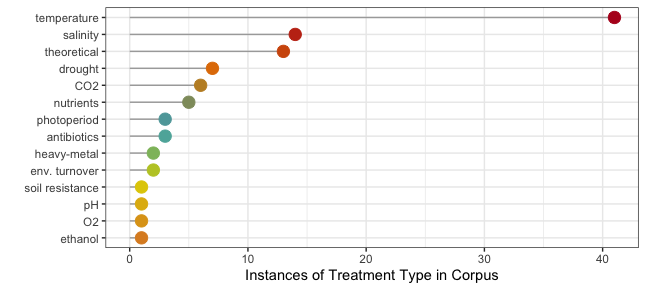
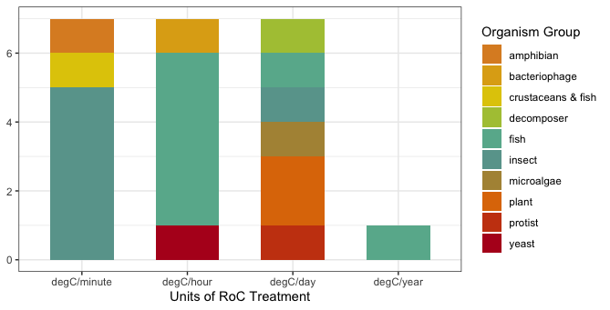

```{r setup, include=FALSE}
knitr::opts_chunk$set(echo = TRUE)
```

## Overview

This activity is an introduction to some techniques and packages that can be used to conduct a systematic review of the literature. We are going to use these techniques to investigate literature about topics relevant for **microbial biospherics**. We will be using the 'research weaving' framework, proposed by Nakagawa *et al.* 2019, including bibliometrics and systematic mapping. From their abstract (emphasis mine):

> "Research weaving provides a novel framework that **combines bibliometrics and systematic mapping** to inform the development of a field, the influence of research papers and their interconnections, and to visualize content across and within publications."

> "Research weaving has the potential to provide a more efficient, in-depth, and broad synthesis of a research field, to identify **research biases, gaps, and limitations**. Such insights have the potential to inform ecological and environmental **policy** and **communicate research findings to the general public** in more effective ways then are typically done in current research syntheses."

You can learn more about research weaving by reading their paper [here](https://doi.org/10.1016/j.tree.2018.11.007).

You will begin by developing a research question, then using Web of Science [WoS](https://apps.webofknowledge.com/WOS_GeneralSearch_input.do?product=WOS&search_mode=GeneralSearch&SID=D5U7NnnEhob17JVozzU&preferencesSaved=) to conduct a search of the literature. You must have a VPN set up in order to use WoS from home -- if you haven't done so yet, follow the instructions from the FU library [here](https://www.zedat.fu-berlin.de/VPN).

Remember that your group must have your research question and search string approved before continuing! 

You will then export the search results as a .bib file. This will be used to conduct an exploratory bibliometrics analysis using the `bibliometrix` package. 

You will then develop inclusion/exclusion criteria and use the `revtools` package to screen literature.

## Developing a research question and search string

### 1. Find a topic with your group

Your first task is to conduct a literature search using Web of Science (WoS) relating to **microbial biospherics**. Possible topics include: (1) closed systems ecological research, (2) microbial ecology research using artificial soils, (3) microbial necromass in soil, (4) microbial necromass recycling, and (5) microorganisms and ecosystem stability. You may also propose a topic of your own that you find interesting, as long as it is relevant for microbial biospherics research. Please discuss this with your group and find a topic that is interesting for all of you. 

### 2. Come up with a research question

You should then come up with a research question. This should be something general enough that it can be addressed by a literature search. For example, "What insights have we gained about microbial ecology from research with artificial soils?" or "What topics and organisms have been studied using closed ecological systems?".

### 3. Start searching...and develop a search string

Your goal is to create a search string that will capture *all* of the papers that are relevant for your research topic. This means that you should think about all possible different words that could describe the same thing, and include them. Usually when you do a 'real' bibliometrics analysis and systematic mapping, you take all relevant papers -- this can involve thousands of articles. Because we only have a few weeks together in the course, you should aim for a topic that results in **100-300 articles**. If your WoS search produces results more than this, you should reduce the scope (e.g. by focusing on a more specific topic).

Here are some examples of search strings:

> ("soil organic matter"  OR "soil organic carbon"  OR "organic matter")  AND (decomposition  OR degradation)  AND drought

this search string uses quotation marks "" to ensure that only articles with the entire phrase "soil organic matter" appear in the results. It also uses multiple words, e.g. 'decomposition' and 'degradation' to describe the same thing. This increases the chances of finding all the relevant articles.

> (soil  AND necromass AND fung*)

this search string uses an asterisk * so that all results starting with 'fung' are shown (e.g. fungi, fungus, fungicide)

You can read about the operators (e.g. AND and OR) that you must use in your search string [here](https://images.webofknowledge.com/images/help/WOS/hs_search_operators.html) and there are more [WoS search tips here](https://clarivate.libguides.com/woscc/searchtips).

### 4. Refine your search and your search string

If your search produces more than 300 results, you should first try to reduce the number of results by making your research question more specific. For example, focus on a specific organism group (e.g. fungi or bacteria). If necessary, you can further reduce the number of search results by using the 'Refine Results' categories on WoS. For example, you might exclude review papers if you want to focus on experimental research. Likewise, if your search produces less than 100 results, you should broaden the scope. When we (me and the Tutors) check out your search string and research question, we can help you with this.

Write down what you do! And remember, these decisions will later influence how you interpret your results!

**Once you have decided on a topic, you must have it approved by me before you and your group continue.**

## Bibliometric Analysis

Once your topic is approved, you may begin the bibliometric analysis. 

### 1. Produce a BibTeX file in Web of Science

There are instructions about how to produce a BibTeX (.bib) file via WoS in [this tutorial](https://www.bibliometrix.org/vignettes/Introduction_to_bibliometrix.html). The tutorial is from the authors of the `bibliometrix` package, Massimo Aria and Corrado Cuccurullo, and contains a lot of information about the various functions available (Aria & Cuccurullo, 2017). The code chunks on this website originate from their tutorial.

I have also recorded a tutorial video showing how to conduct a literature search in the Web of Science and export your results as a .bib file. This is available on [VBrick](https://fu-berlin.eu.vbrickrev.com/sharevideo/2cb4b6bb-11a1-4b38-8618-705412d5fde3). Follow along with the tutorial of your choice and produce your BibTeX file. Take note of how you name the file and the folder where you save it!

### 2. Begin your bibliometric analysis

Now you can begin working in R. Create a new R script for the project. If you have not installed the `bibliometrix` package yet, please do so now, like this:

```{r eval = FALSE}
install.packages("bibliometrix", dependencies=TRUE)
```

and then load the package: 

```{r message = FALSE}
library(bibliometrix)
```

[Documentation can be found here](https://cran.r-project.org/web/packages/bibliometrix/bibliometrix.pdf).
Once you have created a .bib file, you must then load the data in R using the `bibliometrix` package and conduct a bibliometrics analysis. We will begin by loading the data and converting it into a bibliometric dataframe. You might have to wait a few minutes for the bibliographic dataframe to be generated...check the console!

```{r eval = F, message = F}
file <- "your_bibtex_file.bib"

M <- convert2df(file = file, dbsource = "isi", format = "bibtex")
```


Once the dataframe has loaded, check it out. What are the column names?
Hint: try using `colnames()`.
These 2-letter codes are called 'field tags' and there is a complete list [here](https://www.bibliometrix.org/documents/Field_Tags_bibliometrix.pdf). You will need to use these later.

### 3. Perform a descriptive analysis

Continue by performing a descriptive bibliometric analysis and print a summary of the results, using `biblioAnalysis` and `summary`.

```{r eval = F, message = F}
results <- biblioAnalysis(M, sep = ";")
S <- summary(object = results, k = 10, pause = FALSE)
```

Look at the results of the summary in the console to get a sense of your article collection. What are the 5 top-cited papers in your collection? Copy/paste the DOIs into Web of Science and check out the abstracts -- why do you think that they are highly cited? 

```{r include = FALSE}
file <- "/Users/fastloris/Desktop/Desktop/Vertiefungsmodul course materials/WS2021/Praktikum/VM_biblio/soil_necromass_fungi.bib"
M <- convert2df(file = file, dbsource = "isi", format = "bibtex")
results <- biblioAnalysis(M, sep = ";")
S <- summary(object = results, k = 10, pause = FALSE)
```

You can quickly display the DOI or publication year (or any information in the dataframe) by giving the paper/row name and the field code, like this:

```{r}
M["MILTNER A, 2012, BIOGEOCHEMISTRY", "DI"]
M["MILTNER A, 2012, BIOGEOCHEMISTRY", "PY"]
```

Now run the `plot` function. Save the plot showing 'Most Productive Countries'.

```{r eval = F, message = F}
plot(x = results, k = 10, pause = FALSE)
```


### 4. Investigate keywords and their relationships

Let's look at how keywords in the papers are connected. This will give us some insight about how sub-topics within your topic are related to each other. Are there clusters of keywords? What ideas are connected to one another? What does this tell you about your topic? Do this reveal something about the way that groups of people think/study this topic?

```{r}
NetMatrix <- biblioNetwork(M, analysis = "co-occurrences", network = "keywords", sep = ";") # this creates the network
net=networkPlot(NetMatrix, normalize="association", weighted=T, n = 30, Title = "Keyword Co-occurrences", type = "fruchterman", size=T,edgesize = 5,labelsize=0.7) # this plots the network
```

### 5. Local citation networks

We can use local citation networks to explore the relationships between articles in our collection, for example which authors or papers present in our collection were cited frequently by others in the collection. To do this, you can use `localCitations`.

```{r}
CR <- localCitations(M, sep = ";")
```

The results are saved in `CR`, which now contains information about the top *locally* cited authors and articles within your collection. Note that "LCS" provides information about *local* citations (i.e. citations within the collection) and "GCS" provides information about *global* citations (i.e. the number of overall citations that this author or paper has. To understand this better, take a look at the top 3 locally cited authors in `CR`. When you produce a plot of the most productive authors over time, do you find the same top 3 authors? Why or why not?

```{r}
topAU <- authorProdOverTime(M, k = 10, graph = TRUE)
```

### 6. Three fields plot

Finally, we will investigate the relationships between authors, keywords and WoS categories. You can choose any 3 field tags that you would like -- looking at journals (sources) or common cited references could also be interesting. We will do this using a three-fields plot, with the function `threeFieldsPlot`. Search in help search bar in R to read about this function and see an example of its use. Try clicking on one of the keywords or authors in the plot below.

```{r echo = FALSE}
threeFieldsPlot(M, fields=c("AU","DE","SC"),n=c(10,10,10))
```

Make sure to save all of your results and plots from this exercise. You can now complete the first part of the worksheet for this activity.

## Systematic Mapping

The next part of this activity involves screening your papers and extracting some information from them to create a systematic map. 

### 1. Inclusion/Exclusion Criteria

The first step is to create your inclusion/exclusion criteria. In other words, what are the characteristics of papers that you will screen?

You should revisit your research question and decide what kind of articles and data are useful to answer your question. Taking my soil/necromass/fungi search as an example, I might be interested in how fungal diversity and activity affects the decomposition or stabilization of necromass in soil. So, I would only include papers that study both necromass and fungal communities (diversity or functions). I would exclude studies that only investigate bacteria and not fungi or that investigate leaf litter but not necromass. I would also exclude all articles that do not report results from experimental research (e.g. review articles).

Make sure that you write down your inclusion/exclusion criteria!! This is very important for reproducibility.

### 2. Dividing up the papers between your group

Now, back to R, but not for long! We will use `revtools` to screen the abstracts.
Load the revtools package and your BibTeX file:

```{r}
library(revtools)
```

```{r eval = FALSE}
recs <- read_bibliography("soil_necromass_fungi.bib")
```

Now you're going to split the papers up between group members using the `allocate_effort` function. This lets you decide the proportion of articles per person. To have a robust systematic review, it is necessary for some of the articles to be screened by more than one person. In this example, 19% of the articles will be screened by more than one person (this function will try to get as close as possible to the proportion that you choose in 'proportion_checked'). This way you can later make sure that everyone is applying the inclusion/exclusion criteria in the same way.

```{r}
alleff <- allocate_effort(reviewers = c("India", "GroupMember1", "GroupMember2"), effort = c(0.33,0.34,0.33), proportion_checked = 0.2, quiet = FALSE)
```

```{r eval = FALSE}
distribute_tasks(recs, alleff)
```

Some R magic happened behind the scenes when you ran the second line of code. Take a look in your working directory (or in the "Files" tab in RStudio). You should find that there is now a .csv file for each member of your group! **One group member should send all the files created in this step to the other group members** (otherwise you will all have a random assortment of files and will not screen all the abstracts)!

### 3. Abstract Screening

Now you're ready to begin abstract screening. If R is stressing you out, now is your moment to rejoice: you won't be in RStudio too much longer. Now you get to use the shiny web interface! Load your file in R and then use the `screen_abstracts` function. A new window will open up where you can screen your abstracts. Read the title and abstract of the paper, and, based on your inclusion/exclusion criteria, decide whether to include or exclude the article. Click on "Select" or "Exclude" as appropriate. When you are finished, make sure to save your data!! It will not save automatically!

```{r eval = FALSE}
india_papers <- read_bibliography("reviewer_India.csv")
screen_abstracts(india_papers)
```

### 4. Creating a file with the selected articles

After everyone has finished screening articles, you must now put the files back together again. This can be done using the `aggregate` function in revtools. Make sure that the number of columns and column names match in each .csv file, or this won't work.

```{r eval = FALSE}
screened <- c("IM_done.csv", "GM1_finished.csv", "GM2_yes.csv")
aggfiles <- aggregate_tasks(file_names = screened, selection_column = "screened_abstracts", reviewer_names = c("India", "GroupMember1", "GroupMember2"))
write.csv(aggfiles, "agg_screening_results.csv", row.names = F)
```

Now you will look for articles that were selected by one or more group members These will be articles that you will use for systematic mapping and will appear in the dataframe 'def_sel' when you run the code below. You must also look at articles where there were 'conflicts' -- where one person 'selected' and another person 'excluded' the same article. These will appear in the dataframe 'conflict' when you run the code below. Your group should talk about each article with the conflict dataframe and make a decision about whether or not to include each one. **Note:** in the code below, you will have to change the column numbers `[,54:56]` to match *your* aggfiles dataframe. These columns should contain information about how each reviewer screened each article. The number of columns must be the same as the number of group members.

```{r eval = FALSE}
sel <- rowSums(aggfiles[,54:56] == "selected", na.rm = T)
excl <- rowSums(aggfiles[,54:56] == "excluded", na.rm = T)
aggfiles2 <- cbind(aggfiles, sel, excl)
#definitely selected: ONLY selected (NOT excluded) by 1 or more people
def_sel <- aggfiles[c(aggfiles2$sel>0 & aggfiles2$excl==0),]
# conflicts: selected by one, excluded by another
conflict <- aggfiles[c(aggfiles2$sel>0 & aggfiles2$excl>0),]
```

The dataframe def_sel contains the selected papers. After you have discussed all the 'conflict' articles, and decided which articles to include  or not, you can add rows from the 'conflict' dataframe to the def_sel dataframe using `rbind`. **Hint:** look at how `cbind` is used in the code chunk above. Also recall that you can make a small dataframe with certain rows like this: `conflict[c(X,Y,Z),]`. Then you will create a .csv file with all the selected papers:

```{r eval = FALSE}
write.csv(def_sel, "selected_articles.csv", row.names = F)
```

### 5. Data Extraction

Now you will begin extracting data from your articles. You should choose a few pieces of information that are relevant for *your* topic. Some ideas might include: article type, study type, organism studied...Try not to make this too complicated, or it will be very time-consuming. Examples of questions that you might try to answer with the data that you extract: 'Were most of the articles review articles or experimental?' or, 'Did the researchers mostly focus on soil microbes or soil animals?'

Open "selected_articles.csv" using Excel, GoogleSheets, or whatever works for you and your group. Delete all columns except the publication year, journal, title, authors and DOI. Create new column names with the name of the data that you and your group will extract from the articles. Work together to extract data from the articles and fill in the columns in the spreadsheet. You will have to search for the articles using the DOI. (Sometimes it works best when you copy the DOI and the string "doi" in Google, and make sure that you are logged in with your VPN so that you have access!) When you are finished extracting the data from each article, save the results as a .csv file.

### 6. Data visualization

Load the .csv file with your screening results and use the skills that you gained during activity 1 to create 1-2 figures using using ggplot in R. Think about the data that you have extracted and what kind of data visualization would work the best. Your goal here is to show some information about your group of articles using the data that you extracted from the articles. 
Some examples (your figures don't have to be this complicated, but you are welcome to try!):






These examples are from this [systematic review](https://doi.org/10.1111/brv.12639), although not all of them made it into the final draft.
If you like the color scheme, you can check out the [Wes Anderson palettes for R](https://cran.r-project.org/web/packages/wesanderson/wesanderson.pdf).

Help! --> Refer back to [R for Data Science](https://r4ds.had.co.nz/data-visualisation.html). The [R Graph Gallery](https://www.r-graph-gallery.com/index.html) has information about how to create a ton of different type of figures in R.

### 7. Fertig!

You have completed the activity, congratulations! Now you should complete the worksheet, answer all questions and paste your plots. To receive credit for active participation, please (1) email your completed worksheet as a .docx or .pdf file to me: immansour@zedat.fu-berlin.de AND (2) show your work to a Tutor and discuss your answers with them.

Cheers!

## References

Aria, M. & Cuccurullo, C. (2017) bibliometrix: An R-tool for comprehensive science mapping analysis, Journal of Informetrics, 11(4), pp 959-975, Elsevier.

Nakagawa S, Samarasinghe G, Haddaway NR, Westgate MJ, O’Dea RE, Noble DWA, et al. (2019). Research Weaving: Visualizing the Future of Research Synthesis. Trends Ecol Evol 34: 224–238.

Pinek L, Mansour I, Lakovic M, Ryo M, Rillig MC. (2020). Rate of environmental change across scales in ecology. Biol Rev 1: 1798–1811.

Westgate, MJ. (2019) revtools: An R package to support article screening for evidence synthesis. Research Synthesis Methods http://doi.org/10.1002/jrsm.1374 


